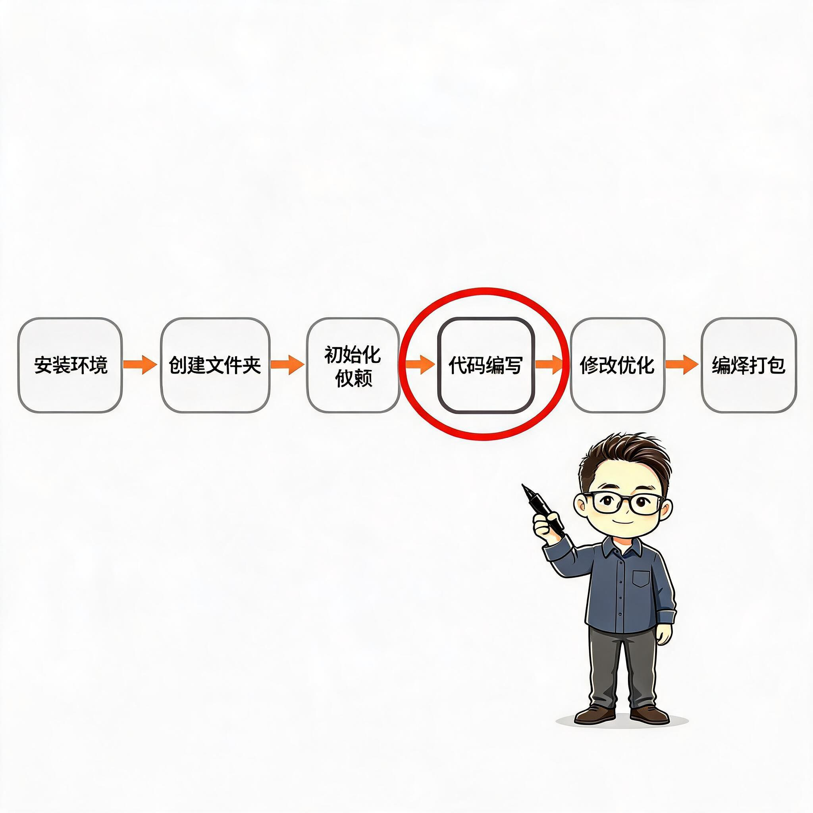
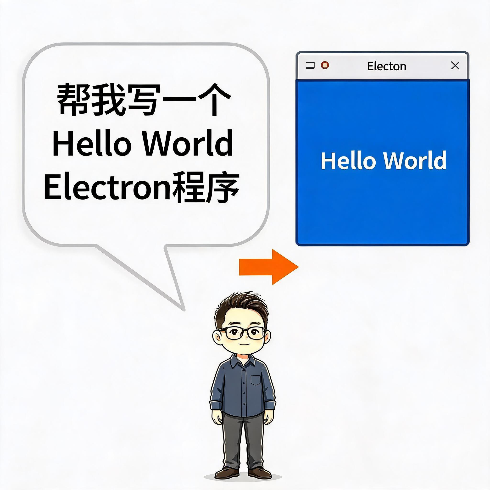
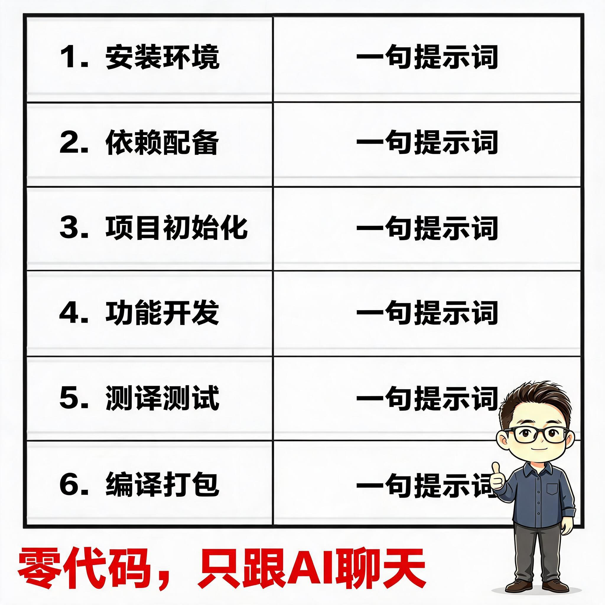
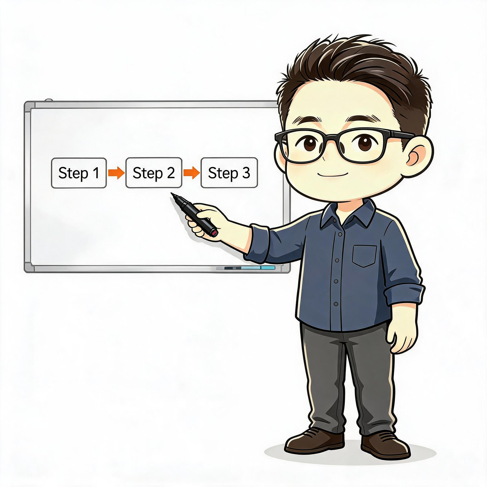

# Little Engineer Illustrator Skill

> 把中文技术文章里的流程、架构、状态和隐喻，变成清爽、有技术气质、结构清晰的 16:9 横版正文配图。
>
> **数字 cel-shading | 小工 IP | 图生图优先 | 纯白背景 | 两套服装体系**

---

## 这是什么

**小工程师配图**是一个 EasyClaw Skill，为中文技术文章、博客、教程、方法论内容自动生成正文配图。

核心思路：让文章里的关键判断、流程、结构或隐喻，由一位 Q版工程师角色 **「小工」** 站在旁边帮你讲出来。**图的主体是信息结构，小工是导游**——站在角落，指向重点，不抢戏。

---

## 小工 IP 形象

| 特征 | 描述 |
|------|------|
| 🧑‍💼 **角色** | 电子/软件工程师，Q版约3.5头身 |
| 💇 **发型** | 深棕色短侧分 quiff，头顶蓬松，浅棕高光 |
| 👓 **眼镜** | 黑色中框方眼镜（框厚约镜片1/5~1/6）——**核心识别符号** |
| 👀 **五官** | 大圆眼（接近正圆），深棕虹膜+白色反光点，细淡眉毛，小巧薄唇，抿嘴微笑 |
| 🎨 **肤色** | 暖桃色 #FFF0D5 |
| 👔 **服装A** | 深灰蓝翻领长袖衬衫 #4B5868，袖口卷起，深炭灰长裤 |
| 🥼 **服装B** | 浅天蓝连体静电无尘服 #94C6E8（工厂/硬件现场场景） |
| 🖌️ **画风** | 干净数字 cel-shading，中等粗细黑色轮廓线，硬边阴影纯色块 |


---

## 示例效果

### Electron 入门文章配图



*01 — 六步全流程：小工在角落指向「代码编写」核心步骤*



*02 — 一句提示词 → Hello World 窗口*


*03 — 源码文件夹 → EXE 文件转换*



*04 — 六步总结表 + 零代码标记*

### 多场景验证

小工同一形象（图生图保持一致性）在不同场景中：

| 白板讲解 | 焊接电路板 | 机柜检修 |
|:---:|:---:|:---:|
|  | *(见下方说明)* | *(见下方说明)* |

> 以上示例均使用**同一张参考底图做图生图**，确保形象统一。

---

## 适用场景

### ✅ 特别适合

- 技术教程文章（安装→配置→编码→打包流程）
- AI + 开发工具内容（Electron、Python、嵌入式、工控）
- 方法论 / 工作流解释（前后对比、概念隐喻、方法分层）
- 需要多篇文章统一视觉 IP 的博客/公众号
- 软硬件结合场景（同一角色两套服装切换）

### ❌ 不太适合

- 商业插画、品牌 KV、精致矢量图
- 复杂架构图、PPT 信息图、课程课件
- 可爱卡通、表情包风格
- 需要真实 App 截图或科技感 UI 的

---

## 功能特性

### 🎯 图生图优先策略

核心创新：**不依赖纯文本生图（文生图角色容易跑偏），而是用参考底图做图生图，锁死形象一致性。**

```
文生图 ❌ → 每张图角色长相随机，眼镜时粗时细，发型飘忽
图生图 ✅ → 同一张参考底图输入，只改场景和姿势，形象稳如磐石
```

参考底图：`ian-xiaohei-illustrations/assets/reference/xiaogong-front.png`

### 👔 智能服装切换

根据文章主题自动选择服装：

- 软件/编程/架构/白板讲解 → **体系A：深灰蓝衬衫**
- 硬件/工厂/焊接/巡检/配电箱 → **体系B：浅天蓝静电服**

### 🏗️ 8种构图结构

| 结构类型 | 适用场景 |
|----------|---------|
| Workflow 流程 | 安装→配置→编码→打包 |
| 系统局部 | 信息源、数据库、agent 模块 |
| 前后对比 | 混乱/有序，手动/自动 |
| 角色状态 | 痛点、信息焦虑、卡住到跑起来 |
| 概念隐喻 | 内容工厂、信息仓库、工作流机器 |
| 方法分层 | 框架层级、能力栈、系统层级 |
| 地图路线 | 想法→上线、学习路线 |
| 小漫画分镜 | 失败→成功、真实过程、使用前后 |

### ✅ 自动质检

每张图生成后自动按 QA 清单检查：

- 小工眼镜是否在中框（不过细不过粗）？
- 头发深棕色非纯黑？
- 肤色暖桃非冷白？
- 角色尺寸是否在 30% 画面高度以内？
- 背景纯白无纹理？
- 无「Workflow / 系统架构图」等模板标题？

---

## 安装

```bash
git clone https://github.com/neo618/little-engineer-illustrator-skill.git
```

将 `ian-xiaohei-illustrations/` 目录放入 EasyClaw skills 目录。

---

## 使用方法

### 配图规划（不生成图片）

```
分析这篇文章哪里值得配图，输出 shot list。
每张图：放在哪段后、主题、结构类型、小工做什么、服装体系、中文标注词。
```

### 直接生成配图

```
为下面的文章生成 4-6 张正文配图。
```

Skill 会自动：选服装体系 → 用参考底图做图生图 → 每张图描述场景 → 生成 → 按 QA 清单检查。

### 文章中的配图引用

生成的图片保存到 `assets/<article-slug>-illustrations/`，按顺序命名 `01-topic.jpg`、`02-topic.jpg` 等。

---

## 核心文件

| 文件 | 用途 |
|------|------|
| `SKILL.md` | Skill 入口，完整工作流 |
| `references/xiaohei-ip.md` | 小工IP：外形、两套服装、动作库、禁止项 |
| `references/style-dna.md` | 风格DNA：色值、线条、构图约束 |
| `references/composition-patterns.md` | 8种构图类型 + 原创隐喻生成法 |
| `references/prompt-template.md` | 图生图/文生图 Prompt 模板 + 正负关键词 |
| `references/qa-checklist.md` | 15项必过检查 + 失败信号 + 迭代方法 |
| `assets/reference/xiaogong-front.png` | 图生图参考底图 |

---

## 目录结构

```text
little-engineer-illustrator-skill/
├── README.md
├── LICENSE
├── .gitignore
├── examples/
│   ├── electron-article/             # Electron文章配图示例
│   │   ├── 01-workflow.jpg
│   │   ├── 02-chat-to-app.jpg
│   │   ├── 03-build-exe.jpg
│   │   └── 04-summary.jpg
│   └── images/                       # 旧版小黑示例（风格校准）
│       ├── 01-two-breakpoints.png
│       └── ...
├── ian-xiaohei-illustrations/        # Skill 核心目录
│   ├── SKILL.md
│   ├── assets/
│   │   ├── examples/                 # 小黑时代示例（低频校准）
│   │   │   ├── 01-two-breakpoints.png
│   │   │   └── ...（共14张去标题版）
│   │   └── reference/                # 小工参考底图
│   │       ├── xiaogong-front.png
│   │       ├── xiaogong-whiteboard-final.jpg
│   │       └── xiaogong-whiteboard-sample.jpg
│   ├── agents/
│   │   └── openai.yaml
│   └── references/
│       ├── xiaohei-ip.md
│       ├── style-dna.md
│       ├── composition-patterns.md
│       ├── prompt-template.md
│       └── qa-checklist.md
└── assets/
    └── ian-wechat-qr.jpg
```

---

## 从哪改

想自定义小工的形象、风格或行为？改这些文件：

| 你想改什么 | 改哪个文件 | 改什么内容 |
|-----------|-----------|-----------|
| 🧑 小工的长相 | `references/xiaohei-ip.md` | 发型、眼镜、眼睛、肤色、服装色值、禁止项 |
| 🎨 画风 / 配色 | `references/style-dna.md` | 线条粗细、色值、留白比例、审美方向 |
| 📐 构图模式 | `references/composition-patterns.md` | 结构类型、物件池、小工动作池 |
| ✍️ 生图 Prompt | `references/prompt-template.md` | 正向/负向关键词、图生图指令、服装切换 |
| ✅ 质检规则 | `references/qa-checklist.md` | 必过项、失败信号、迭代方法 |
| 📋 Skill 工作流 | `SKILL.md` | 配图策略、生成流程、输出口径 |

修改后提交 Git，Skill 自动跟随。

---

## 致谢

本项目基于 [Ian Xiaohei Illustrations](https://github.com/helloianneo/ian-xiaohei-illustrations) 演化而来。

感谢原作者 **Ian (伊恩)** 的开源贡献和出色的 Skill 架构设计，为本项目提供了坚实的技术参考和灵感来源。

---

## 迭代历程

| 版本 | 变化 |
|------|------|
| **v2.0** | 小黑→小工：怪物→工程师，手绘→数字cel-shading，+两套服装，+图生图优先 |
| **v1.0** | 初版小黑：黑色实心怪物，白点眼，手绘抖动线条，怪诞产品草图 |

---

## License

MIT License. See [LICENSE](LICENSE).
